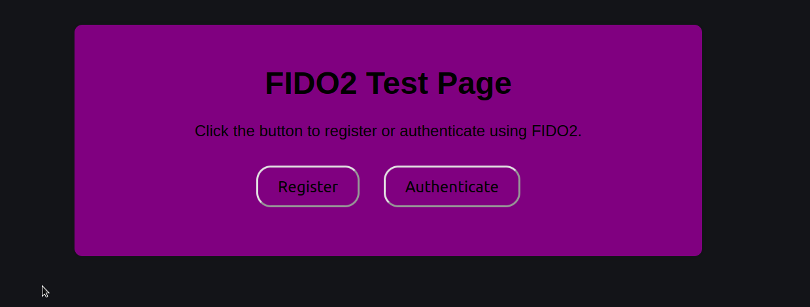

# Fido2 Test

## Description

Test your Fido2 before to sign to any website or if you dont use it for a long of time.

## Features

- Register test
- Authenticate test

## Installation

1. Clone the repository: `git clone https://github.com/carlostkd/fido2.git`
2. Navigate to the project directory: `cd fido2`
3. You need to create your server side logic...
4. Host it somehere or with your apache/nginx server.

## Screenshot

## Usage

Navigate to the webpage connect your Fido2 device to the computer and press Register/Authenticate 

## Demo Live

Try the [demo live](https://www.carlostkd.ch/fido/) to see how it works.

