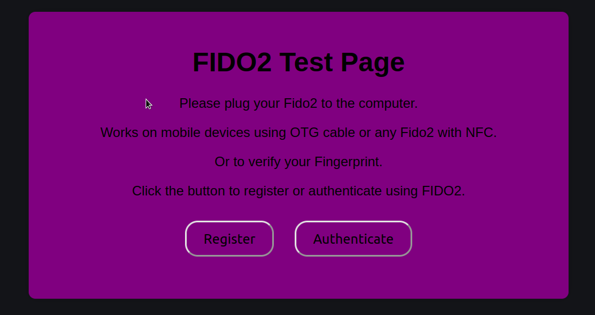

# Fido2 Test

## Description

Test your Fido2 before to sign to any website or if you dont use it for a long time.

## Features

- Register test
- Authenticate test
- Works on mobile devices using OTG cable or any Fido2 with NFC
- If you have Fingerprint enabled on you Mobile device you can use this toll to verify if your Fingerprint Credentials   are correct and working as well.

## Installation

1. Clone the repository: `git clone https://github.com/carlostkd/fido2.git`
2. Navigate to the project directory: `cd fido2`
3. You need to create your server side logic... as i dont know what server are you using the server code is not on this repo.
4. Host it somehere or with your apache/nginx server.

## Screenshot

## Usage

Navigate to the webpage connect your Fido2 device to the computer and press Register/Authenticate.
Ignore and click Proceed on the warning popup (you always get this warning for any website when using the key for the first time).

On mobile devices to verify your Fingerprint just press Register and follow the instructions on your Mobile.

## Demo Live

Try the [demo live](https://www.carlostkd.ch/fido/) to see how it works.

